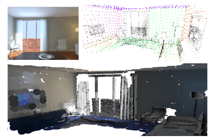
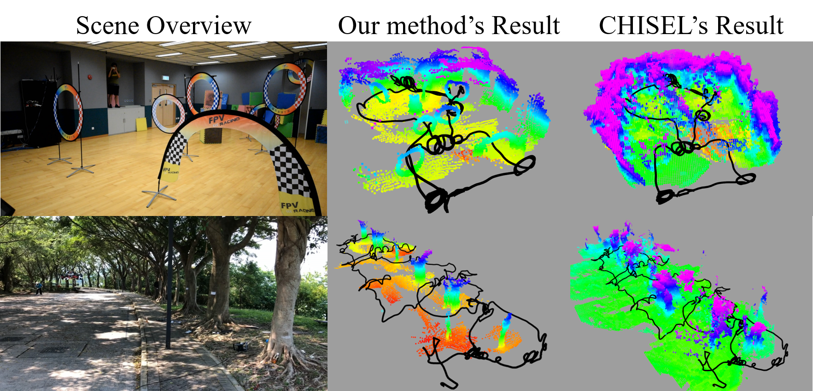
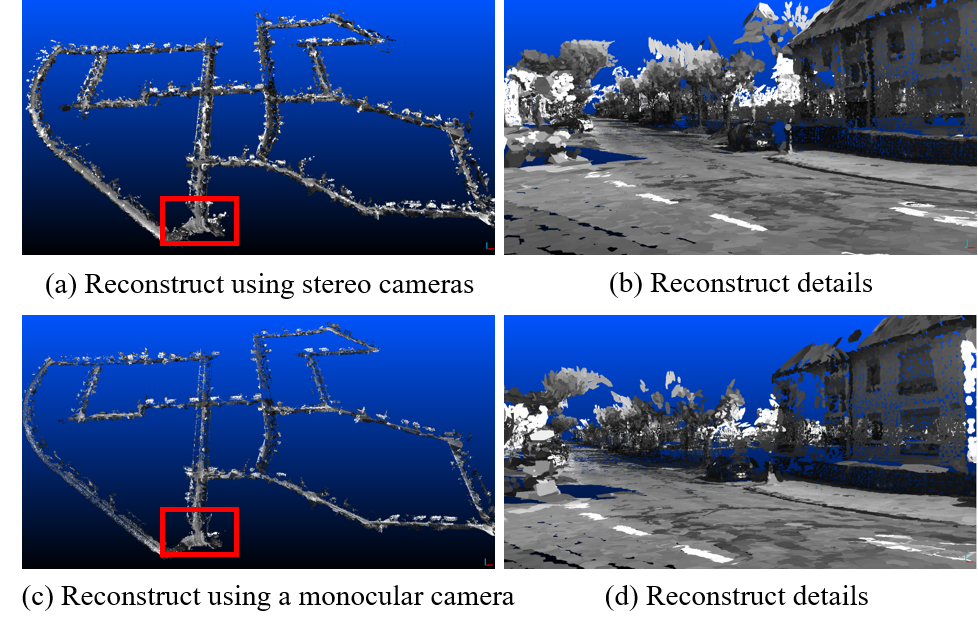

# SurfelMapping
Surfel-based mapping is an efficient way for 3D dense reconstruction. 

### ManhattanSLAM

**You can find the paper [here](https://arxiv.org/pdf/2103.15068.pdf), code here. If the project helps you in your paper, PLEASE cite it.**

<p align="center">

</p>


## DenseSurfelMapping system

**You can find the paper [here](https://www.dropbox.com/s/h9bais2wnw1g9f0/root.pdf?dl=0), code [here](https://github.com/HKUST-Aerial-Robotics/DenseSurfelMapping).If the project helps you in your paper, PLEASE cite it.**

## A depth map fusion method

This is a depth map fusion method following the ICRA 2019 submission **Real-time Scalable Dense Surfel Mapping**, Kaixuan Wang, Fei Gao, and Shaojie Shen.

Given a sequence of depth images, intensity images, and camera poses, the proposed methods can fuse them into a globally consistent model using surfel representation. The fusion method supports both [ORB-SLAM2](https://github.com/raulmur/ORB_SLAM2) and [VINS-Mono](https://github.com/HKUST-Aerial-Robotics/VINS-Mono) (a little modification is required) so that you can use it in RGB-D, stereo, or visual-inertial cases according to your setups. We develop the method based on the motivation that the fusion method: (1) can support loop closure (so that it can be consistent with other state-of-the-art SLAM methods),  (2) do not require much CPU/memory resources to reconstruct a fine model in real-time, (3) can be scaled to large environments. These requirements are of vital importance in robot navigation tasks that the robot can safly navigate in the environment with odometry-consistent dense maps.

An example to show the usage of the surfel mapping is shown below.

<p align="center">

</p>


Left is the overview of the environment, the middle is the reconstructed results (visualized as point clouds in rviz of ROS) of our method, and right is the result using [OpenChisel](https://github.com/personalrobotics/OpenChisel). We use VINS-Mono to track the camera motion with loop closure, and [MVDepthNet](https://github.com/HKUST-Aerial-Robotics/MVDepthNet) to estimate the depth maps. The black line is the path of the camera. In the reconstruction, loop closure is enabled to correct the detected drift. OpenChisel is a great project to reconstruct the environment using the truncated signed distance function (TSDF). However, as shown in the example, it is not suitable to be used with SLAM systems that have loop closure abilities.

The system can also be applied to the KITTI datasets in real-time with only CPU computation.

<p align="center">

</p>


The top row is the reconstruction using stereo cameras and the bottom row is the reconstruction using **only the left camera**. Details can be found in the paper.

### Software

The open-sourced surfel fusion system is used for reconstructing the KITTI dataset using ORB_SLAM2. For VINS-MONO, we are using it in a [teach-and-repeat project](https://www.youtube.com/watch?v=ehoJi4K_QKE) and will opensource lately. This project consists of three parts: the surfel_fusion, a modified ORB_SLAM2, and a kitti publisher.

## ORB_SLAM2
The ORB_SLAM2 is from the original [one](https://github.com/raulmur/ORB_SLAM2) and is modified to publish necessary information. You may install the ORB_SLAM2 following the original instructions.

## Surfel_fusion
Surfel_fusion can be installed in ros catkin workspace by 
```
catkin_make
```

## Kitti publisher
kitti publisher is a simple python warper to publish the Kitti dataset along with the pre-calculated depth maps (using [PSMNet](https://github.com/JiaRenChang/PSMNet)).

### Data

Here, we provide sequence 00 from the kitti dataset so that you can easily run the code. You can download the dataset from [this_link](https://www.dropbox.com/s/qpn40yt8bjvkapd/kitti_sequence_00.tar.gz?dl=0).

###  Compile and Run the code

If you have installed all three components from the software

1. change line 23 in ```./kitti_publisher/scripts/publisher.py``` according to your downloaded dataset path.
2. change the path ```/home/wang/software/ORB_SLAM2/Vocabulary/ORBvoc.txt``` and ```/home/wang/software/ORB_SLAM2/Examples/Stereo/KITTI00-02.yaml``` in ```/ORB_SLAM2/orb_kitti_launch.sh``` according to your environment.

#### Compile 

(1). compile ORB_SLAM2

./build.sh

./build_ros.sh

```
export ROS_PACKAGE_PATH=${ROS_PACKAGE_PATH}:~/Documents/research/DenseSurfelMapping/ORB_SLAM2/Examples/ROS
```

(2).  compile kitti_publisher

build a conda environment and install related libs

```
 pip install opencv-python pillow pycocotools matplotlib
 pip install .......
 mkdir build 
 cd build
 cmake ..
 make
```

```
source ~/catkin_cvbridge/src/vision_opencv/cv_bridge/build/devel/setup.bash --extend
source devel/setup.bash 
```

(3). compile surfel_fusion

```
mkdir build
cd build
cmake ..
make -j4
source build/devel/setup.bash 
```

#### Run

```
roscore
```

open four terminal windows: run the ORB_SLAM2 by

```
./orb_kitti_launch.sh 
```

, run the surfel fusion by

```
roslaunch surfel_fusion kitti_orb.launch
```

, and run the kitti publisher by

```
rosrun kitti_publisher publisher.py
```

, and run the rviz by

```
rviz
```
then open the  rviz_config.rviz file in the surfel_fusion folder to load published messages

**Note:**the kitti publisher will initialize a window and you can start the publisher by **press any key **on that window. Press ***Esc*** will quit the publisher.

### Save the result

The code also supports saving the reconstructed model by changing line 22 in ```/surfel_fusion/launch/kitti_orb.launch```. Just press crtl+c on surfel fusion will cause the software to save meshes into the defined the path and quit the process. You can view the saved mash using [CloudCompare](https://www.danielgm.net/cc/) or other softwares.

### Issues

https://www.programmersought.com/article/57675085764/ 

**1. reinit catkin** 

catkin init --workspace  .  

**2. cv_bridge**: install cv_bridge with python3   

useful links: *https://cyaninfinite.com/ros-cv-bridge-with-python-3/*  *https://stackoverflow.com/questions/49221565/unable-to-use-cv-bridge-with-ros-kinetic-and-python3*

from cv_bridge.boost.cv_bridge_boost import getCvType
ImportError: dynamic module does not define module export function (PyInit_cv_bridge_boost)

```
sudo apt-get install python-catkin-tools python3-dev python3-catkin-pkg-modules python3-numpy python3-yaml ros-kinetic-cv-bridge
# Create catkin workspace
mkdir catkin_workspace
cd catkin_workspace
git clone https://github.com/ros-perception/vision_opencv.git src/vision_opencv
```

```
cd build
```

          ```
cmake  -DPYTHON_EXECUTABLE=/home/yanyan/miniconda3/envs/TFSLAM/bin/python3  -DPYTHON_INCLUDE_DIR=/home/yanyan/miniconda3/envs/TFSLAM/include/python3.7m -DPYTHON_LIBRARY=/home/yanyan/miniconda3/envs/TFSLAM/lib/libpython3.7m.so .. 

make
          ```

register cv_bridge

```
source install/setup.bash --extend
```

test cv_bridge

```
python3

Python 3.5.2 (default, Nov 23 2017, 16:37:01) 
[GCC 5.4.0 20160609] on linux
Type "help", "copyright", "credits" or "license" for more information.
>>> from cv_bridge.boost.cv_bridge_boost import getCvType
>>> 
```

**3. don't forget to register setup.bash **

```
$ roslaunch relaxed_astar test.launch
[test.launch] is neither a launch file in package [relaxed_astar] nor is [relaxed_astar] a launch file name
The traceback for the exception was written to the log file

$ source /home/user/catkin_ws/devel/setup.bash
```


